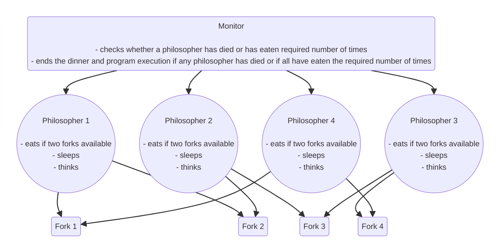
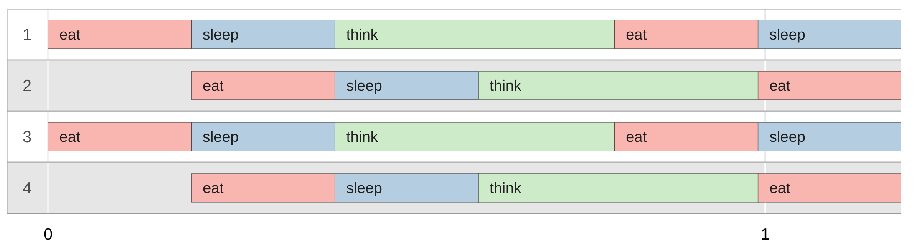

# Philosophers

## Table of Contents
- [Summary](#summary)
- [Installation and Usage](#installation-and-usage)
- [Inputs](#inputs)
- [Output Format](#output-format)
- [Program](#program)
- [Example](#example)
- [Learnings](#learnings)
- [Debugging](#debugging)
- [Sources](#sources)

## Summary
The "philo" program provides a solution to the classical [dining philosophers problem](https://en.wikipedia.org/wiki/Dining_philosophers_problem), aiming to demonstrate synchronization techniques in concurrent programming.

For the detailed requirements, please refer to the [subject](./en.subject.pdf).

## Installation and Usage

To install and use the "philo" program, follow these steps:

1. Clone the repository to your local machine, navigate to the directory, and build the program using the provided Makefile:
	```
	git clone https://github.com/deniz-oezdemir/Philosophers
	cd Philosophers
	make
	```

2. Run the program with the desired arguments. For example:
	```
	./philo 4 800 200 200 2
	```

	This command runs the program with 4 philosophers, a maximum time to live of 800 milliseconds, a time to eat of 200 milliseconds, a time to sleep of 200 milliseconds, and each philosopher must eat 2 times for the dinner to end.

	Note: Make sure to replace the arguments with your desired values.

3. Observe the program's output, which will display the state changes of the philosophers as they dine.


## Inputs
The program takes several arguments:
- `number_of_philosophers`: the number of philosophers at the table.
- `time_to_die`: the maximum time a philosopher can live without eating (in milliseconds).
- `time_to_eat`: the time it takes for a philosopher to eat a meal (in milliseconds).
- `time_to_sleep`: the time it takes for a philosopher to sleep (in milliseconds).
- `number_of_times_each_philosopher_must_eat`: optional argument specifying the number of times each philosopher must eat for the dinner to end.

The `time`-arguments are provided in milliseconds.

## Output Format
The program prints a list of philosophers' state changes in the following format:

```
timestamp_in_ms Philosopher_Number has taken a fork
timestamp_in_ms Philosopher_Number is eating
timestamp_in_ms Philosopher_Number is sleeping
timestamp_in_ms Philosopher_Number is thinking
timestamp_in_ms Philosopher_Number died
```

## Program
1. Reads and validates input arguments.
2. Creates structures for the program data and the philosophers' data.
3. Initialize mutexes and allocates memory.
4. Creates a thread for each philosopher and a thread monitoring the philosophers.
5. Cleans up resources after dining completion.

## Example
The execution of `./philo 4 800 200 200 2` can be represented by the following program structure:



The execution generates the following output:

```
0 1 has taken a fork
0 1 has taken a fork
0 3 has taken a fork
0 3 has taken a fork
0 3 is eating
0 1 is eating
200 1 is sleeping
200 3 is sleeping
200 2 has taken a fork
200 2 has taken a fork
200 2 is eating
200 4 has taken a fork
200 4 has taken a fork
200 4 is eating
400 1 is thinking
400 4 is sleeping
400 3 is thinking
400 2 is sleeping
600 4 is thinking
600 2 is thinking
790 1 has taken a fork
790 1 has taken a fork
790 1 is eating
790 3 has taken a fork
790 3 has taken a fork
790 3 is eating
990 1 is sleeping
990 3 is sleeping
990 2 has taken a fork
990 2 has taken a fork
990 2 is eating
990 4 has taken a fork
990 4 has taken a fork
990 4 is eating
1190 3 is thinking
1190 4 is sleeping
1190 1 is thinking
1190 2 is sleeping
1190 all philosophers have eaten 2 times
```
This output can be [visualized](https://nafuka11.github.io/philosophers-visualizer/) as below:



After each philosopher has eaten twice, the dinner ends and the program stops executing.

## Learnings
### Processes
- Each capable of hosting multiple threads.
- Upon using fork(), everything gets duplicated, including variables.
- Modifying a variable in one process does not propagate to the same variable in another process.

### Threads
- Share the same memory space.
- Modifications to variables within a thread are visible to all other threads.
- Concurrent access to shared variables among multiple threads can lead to "memory races," where the outcome depends on which thread executes first.
- To mitigate "memory races," akin to managing "memory leaks," synchronization mechanisms are essential.

### usleep() Function
The [usleep()](https://man7.org/linux/man-pages/man3/usleep.3.html) is slow such that it was necessary to write a [more precise sleep](https://medium.com/@jalal92/the-dining-philosophers-7157cc05315) function.

## Debugging
- Useful [visualizer](https://nafuka11.github.io/philosophers-visualizer/)
- Compile with flag `-fsanitize=thread` to find data races and deadlocks
- Compile with flag `-fsanitize=address` to find memory leaks
- `valgrind` with and without the flag `--tool=helgrind` only works for very short program runtimes or the case with one philosopher - otherwise the machine freezes

## Sources
- [Explanation](https://42-cursus.gitbook.io/guide/rank-03/philosophers) of the problem, the necessary concepts and functions
